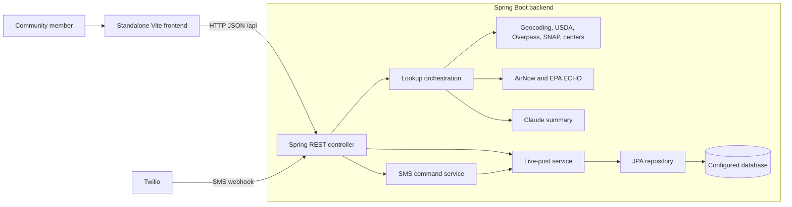

# StreetAid

StreetAid is an Atlanta community-resource finder. The project is now split into a standalone Vite frontend and a Spring Boot REST backend. The frontend owns browser presentation and calls `/api`; the backend owns lookup logic, persistence, and provider integrations.

## Architecture



## Repository layout

```text
frontend/                         Standalone Vite client
	index.html
	src/api.js                      HTTP client for the backend API
	src/main.js                     Browser interactions and rendering
	src/style.css                   Frontend styles
	vite.config.js                  Local API proxy to localhost:8080
src/main/java/.../controller/     REST endpoints
src/main/java/.../service/        Use cases and external-data services
src/main/java/.../repository/     Database access
src/main/java/.../model/          API response models
src/main/resources/data/          Local CSV and transit data
src/test/java/                    Backend tests
```

The frontend and backend remain in this one Git repository, but can be developed, built, and deployed independently. Spring no longer serves the frontend files.

## Run locally

### Backend

Configure Spring's datasource properties (`SPRING_DATASOURCE_URL`, `SPRING_DATASOURCE_USERNAME`, and `SPRING_DATASOURCE_PASSWORD`) plus any provider credentials you have (`GOOGLE_MAPS_API_KEY`, `AIRNOW_API_KEY`, and `ANTHROPIC_API_KEY`). The Atlanta demo ZIPs have hardcoded geocoding coordinates and several providers have fallbacks, so some lookup features can still respond without every optional provider credential. Start Spring Boot from the repository root:

```powershell
./mvnw.cmd spring-boot:run
```

The backend listens on port `8080` by default. The frontend-origin allowlist defaults to `http://localhost:5173`; set `FRONTEND_ORIGIN` to the deployed frontend origin when hosting the frontend separately. Do not commit API credentials.

### Frontend

In a second terminal:

```powershell
cd frontend
npm install
npm run dev
```

Open the Vite address (normally `http://localhost:5173`). During development, Vite proxies `/api` requests to `http://localhost:8080`.

Optional frontend configuration: copy `frontend/.env.example` to `frontend/.env.local`. `VITE_API_BASE_URL` points at a separately hosted backend; `VITE_GOOGLE_MAPS_API_KEY` enables the optional map. Any `VITE_*` value is public browser configuration, so never put server-side secrets there.

Build the static frontend with `npm run build` from `frontend/`; Vite writes deployment assets to `frontend/dist/`.

## API surface

- `GET /api/lookup?zip=30314` — nearby resources and environmental summary.
- `GET /api/live?zip=30314` — active community posts.
- `POST /api/live` — create a community post.
- `DELETE /api/live/{id}` — close a post.
- `POST /api/sms/webhook` — Twilio SMS webhook.
- `GET /api/health` — basic service health response.

## Integrations

The backend connects to Google Geocoding, OpenStreetMap Overpass, AirNow, EPA ECHO, Anthropic Claude, Twilio, and local USDA/SNAP/MARTA files. Some services use fallback data when a provider is unavailable. Treat resource and environmental information as a starting point and confirm time-sensitive details with the provider.

